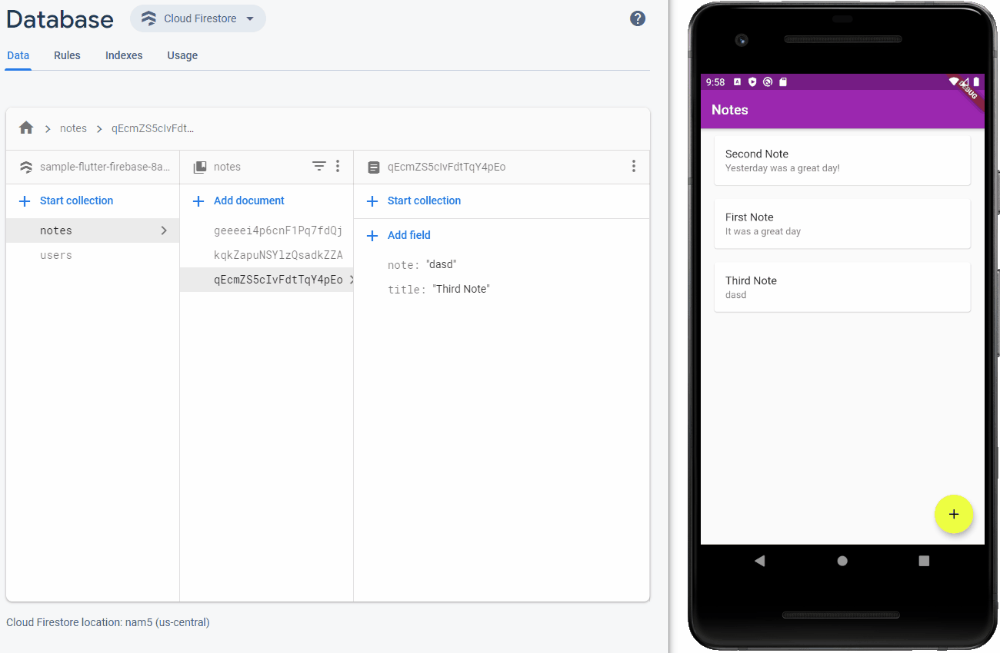

# Notes App

Note taking app with Firebase's Cloud Firestore as the backend.

<a href="https://youtu.be/BTTBy3tk4ag" target="_blank">Live Coding Video on YouTube</a>

## Skills Used

* Firebase's Cloud Firestore
  * Add, update, and delete documents
* StreamBuilder
* Card and ListTile
* Adding IconButtons to the AppBar

## Screenshot

